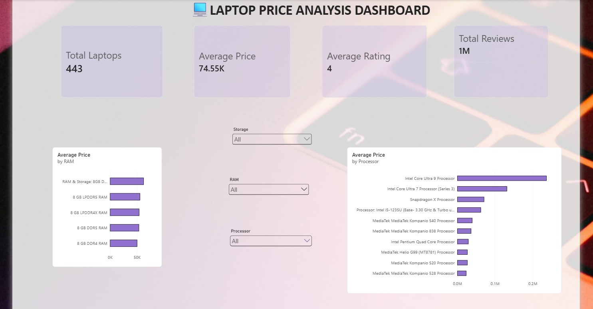

# 💻 Flipkart Laptop Price Analysis (End-to-End)

An end-to-end data project that scrapes, stores, analyzes, and (eventually) predicts laptop prices using live Flipkart listings — combining web scraping, SQL, and Power BI in one pipeline.

## Part 1: Web Scraping

### ✨ What I Built

- A scraper that pulls laptop listings from Flipkart's search/category pages.
- It extracts: Name, Price, Rating, Reviews, Image_URL, Product_Link, Specifications.
- Handles pagination so I could collect data across multiple pages, not just one.
- Outputs everything into a clean CSV, ready for the next stage (SQL).
- I used Selenium specifically because Flipkart's listings are loaded dynamically via JavaScript — a simple requests/BeautifulSoup approach wouldn't have worked here.

### 🛠️ Tech Stack

- Language: Python
- Scraping: Selenium WebDriver
- Data handling: Pandas
- Output format: CSV

### ⚙️ How It Works

Here's what happens when I run the scraper:

1. Selenium launches a Chrome browser session and navigates to Flipkart's laptop listings
2. It waits for the dynamic content to load, then locates listing elements using XPath/CSS selectors
3. For each listing, it extracts price, specs, and product details
4. It loops through pagination to scale up the dataset instead of stopping at page 1
5. Finally, it cleans and saves everything into `laptops.csv`

### ⚠️ Scope & Limitations

My dataset covers laptops returned by searching the generic term **"laptop"** on Flipkart — roughly **500 listings**. This is *not* Flipkart's full laptop catalog.

Flipkart's search results are query-dependent — searching a specific brand (e.g. "ASUS", "Samsung") or model surfaces additional listings that don't show up under a generic "laptop" search. Flipkart's total laptop inventory across all such queries likely runs into a few thousand listings.

## Part 2: Data Cleaning with SQL

🛠️ Tech Stack
Database: MySQL
Tool used: MySQL Workbench

✨ What I Did
1. Dropped columns that weren't going to be useful for analysis or the dashboard.
2. Added an auto-increment primary key — gave every row a unique ID.
3. Used TRIM() to clean up extra whitespace that was left over from scraping.
4. Went column by column to validate that values actually matched what the column claimed to hold, setting anything unmatched or missing to NULL instead of   leaving bad data in place
   
## 📊 Exploratory Data Analysis (SQL)

During the analysis, I observed that:
- HP has the highest number of laptop listings in the dataset, followed by Samsung and ASUS.
- Most laptops fall within the Mid-range (₹40K–₹80K) price segment.
- Samsung has the highest average customer rating among major brands.
- 512 GB SSD is the most commonly available storage option.
- Laptop prices generally increase as storage capacity increases.
- The same processor is offered by multiple brands but at different price points.
- Windows 11 is the most widely used operating system across laptop brands.
- Some brands provide better value for money based on their Rating-to-Price ratio.

## Part 3: Data Visualization with Power BI

🛠️ Tech Stack  
Tool used: Power BI Desktop

✨ What I Did

1. Imported the cleaned laptop dataset into Power BI.
2. Created KPI cards to display key metrics such as:
   - Total Laptops
   - Average Price
   - Average Rating
   - Total Reviews
3. Built interactive bar charts to analyze:
   - Average laptop price by RAM
   - Average laptop price by Processor
4. Added slicers for **Storage, RAM, and Processor** so the dashboard can be filtered dynamically.
5. Designed the dashboard to provide a quick overview of the laptop market and make comparisons between different specifications easier.

📊 Dashboard Insights

The Power BI dashboard provides an interactive view of the dataset, allowing users to explore how laptop prices vary across different hardware configurations.

Users can filter the dashboard based on **Storage, RAM, and Processor** to see how these specifications affect the average price.

<table>
<tr>
<td width="35%" valign="top">

## 📈 Key Metrics

- **Total Laptops:** 443
- **Average Price:** ₹74.55K
- **Average Rating:** 4
- **Total Reviews:** 1M+

</td>

<td width="65%" valign="top">

</td>
</tr>
</table>

